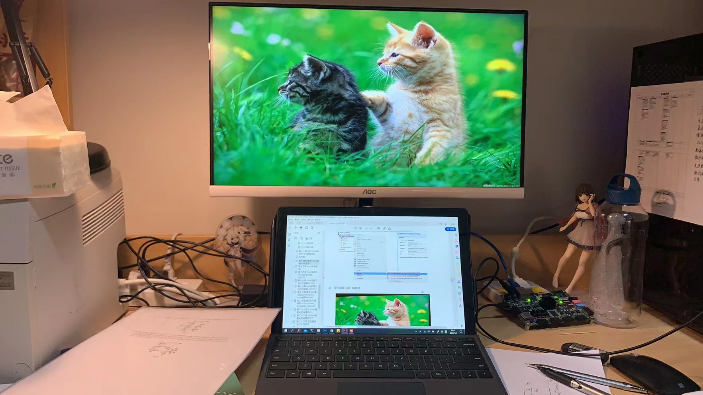

# 备忘录

## 实验进展

在子系统方面，分别测试了：

- `led_test`：流水灯，测试PL
- `ps_hello`：纯PS通过串口发出hello world
- `hdmi_test`：纯PL驱动hdmi
- `pl_rw_ps_ddr`：PL直接读取DDR（利用AXI4协议支持的HP高速访问端口）
- `bram_test`：PS与PL通过BRAM交换数据
- `net_test`：ETH echo server（对主机发送的字符进行回声）
- `vdma_hdmi_out`：VDMA（利用Xilinx现有的IP，对已经存在于DDR中的图片进行直接读取显示）

这些demo，在经过调试之后，都能正常的绑定引脚，加载至硬件启动，得到正确的输出。其中后三个demo是系统必须的组成部分。

目前看起来，VDMA的例程中就进行了一次HDMI buffer的更新，所以应当可以一张图片长期直出；并且注意到HDMI的分辨率实际上就是800*600。

## 硬件架构

在一次 Upsampling 过程中：

1. 由主机通过ETH发出一个请求，得到回应之后发送图片数据，再发送图片结束，进行结束握手（可能是校验）。
2. 从机在与主机握手后，PS对每一个图片包，都写入DDR（在裸机情况下，应该是直接写入固定地址），在写入结束后通知PL。
3. PL在得到PS通知之后，调用IP开始读取DDR进行超分辨率，并写回DDR，超分辨率结束后通知PS。
4. PS得到通知后，将图片由ETH回传，并进入图片查看模式。

## 技术难点

技术难点指的是没有找到直接教程或者demo，而又必须做到的技术内容。

### LWIP协议

如何利用ETH发送读取，这些都是不清楚的，仅仅是echo server能跑是完全不够的，必须要理解协议才可能修改。黑金有向上位机传送摄像头内容的demo，其中可能有可以借鉴的代码。

### 上位机驱动程序

要解析图片数据，分包发送图片数据，还需要接收图片数据，重新组织成一个可读的二进制图片文件，这些都需要驱动程序，不能仅仅在putty的命令行内进行。在黑金的教程之中传送摄像头内容的教程中，有一个接收显示视频的exe，但不能作为本系统的驱动。

目前对于ETH能进行文件读写的程序有一个<https://github.com/nicedayzhu/netAssist>，尚未测试验证。

### DDR访存

在没有文件系统的情况下访存是一件困难的事情，目前的设想是固定所有图片的地址，直接进行内存级的读写，避免上系统之后还需要进行系统层的通信考虑。

## 待掌握的内容

### BRAM的使用

黑金的教程中给出了RAM、ROM、FIFO三个用法，目前尚未试验。
